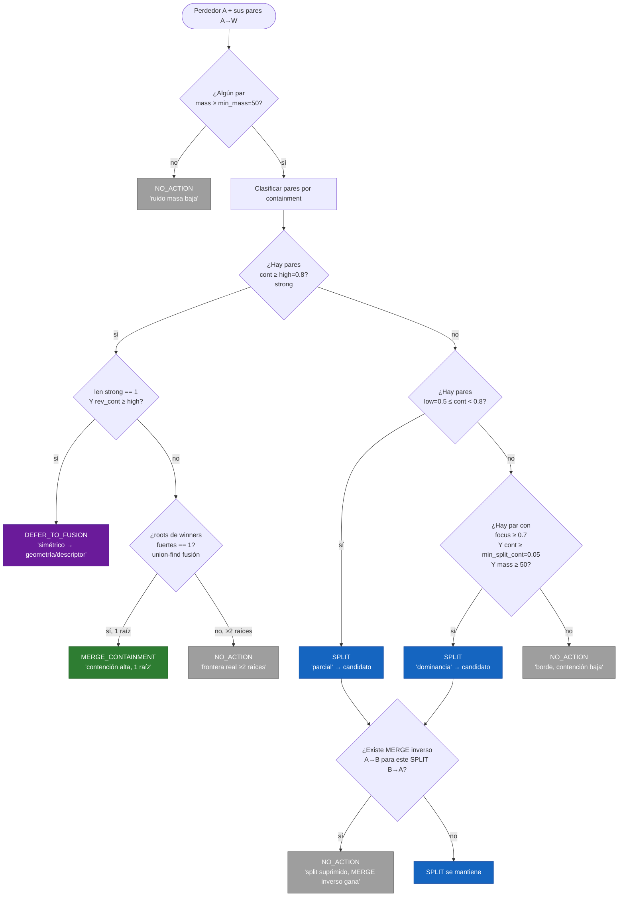

# Flujo de decisión — Contest (merge/split de instancias)

Diagrama del camino real que recorre cada **perdedor** en
`ContestDiscriminator.classify()` + reconciliación en `ContestManager._reconcile()`.

Umbrales por defecto: `high=0.8`, `low=0.5`, `min_mass=50`,
`min_split_cont=0.05`, `min_count=1`.

## Dónde cae cada caso real (office3)

| Caso | Realidad | Veredicto actual | Rama | ¿Correcto? |
|------|----------|------------------|------|------------|
| 63/151 | misma pared, 2 trozos adyacentes | SPLIT ambos sentidos | parcial + dominancia | ✗ debería MERGE |
| 148/194 | misma silla (respaldo+asiento) | SPLIT | parcial/dominancia | ✗ debería MERGE |
| 95 | trozo que debería fusionar | NO_ACTION | frontera real ≥2 raíces | ✗ blob vecino bloquea |
| 91 | trozo de mesa → 103, hay blob mesa+silla | NO_ACTION | frontera real ≥2 raíces | ~ se protege, no arregla |
| 89/103 | mesa mal segmentada unida a silla | SPLIT | dominancia | ~ split real pero veneno upstream |
| 31/22 | objetos distintos | SPLIT | dominancia | ✗ falso positivo |
| 18/26 | objetos distintos | SPLIT | dominancia | ✗ falso positivo |
| 188 | suelo oversegmentado | NO_ACTION | borde | ~ ruido |

## Limitaciones que revela el diagrama

1. **Containment solo ve anidamiento, no adyacencia.** Trozos del mismo objeto
   pegados lado a lado (silla, pared) dan cont baja en ambos sentidos → caen en
   SPLIT en vez de MERGE. La rama STRONG nunca se activa. Falta una señal de
   **descriptor/cooccurrence** paralela a containment.

2. **Blob upstream mal segmentado envenena `roots`.** Un vecino-basura aparece
   como 2ª raíz fuerte → `frontera real` bloquea merges legítimos (95, 91). El
   orden debería ser: **ejecutar SPLIT del blob → recomputar → MERGE.**

3. **Rama dominancia demasiado agresiva.** cont~0.1 + focus alto marca SPLIT
   entre objetos vecinos distintos (31/22, 18/26). Subir `min_split_cont`
   0.05 → 0.15 las elimina sin tocar las legítimas.
